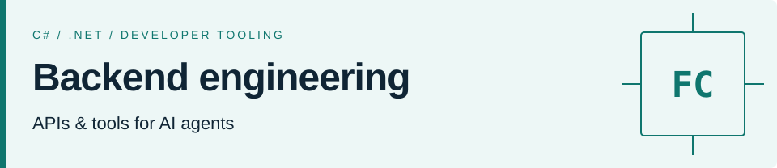

<picture>
  <source media="(max-width: 600px)" srcset="assets/header-mobile.svg">
  <source media="(prefers-color-scheme: dark)" srcset="assets/header-dark.svg">
  
</picture>

# Felipe Cabral

**Software engineer · .NET backend & AI developer tooling**

I build .NET APIs and tools for working with AI agents. My public projects cover application architecture, automated testing and the review of software interfaces. Based in Brasília, Brazil.

[LinkedIn](https://www.linkedin.com/in/felipesbcabral/) · [Email](mailto:felipesbcabral@gmail.com) · [Português](README.pt-BR.md)

## Selected work

### [agentic-os](https://github.com/felipesbcabral/agentic-os)

A portable Markdown toolkit for AI agents, with review gates, execution loops and verification. Includes adapters for Claude Code and Codex.

`AI agents` `Developer tooling` `Markdown` `JavaScript`

### [software-ui-design](https://github.com/felipesbcabral/software-ui-design)

A skill for designing and reviewing SaaS interfaces. Combines component research with automated checks at desktop, tablet and mobile sizes.

`UI engineering` `Node.js` `Playwright` `Claude Code / Codex`

### [codeflix-backend](https://github.com/felipesbcabral/codeflix-backend)

A video catalog API study project in C# and .NET. Explores Clean Architecture and DDD, with unit, integration and end-to-end test projects.

`C#` `.NET` `Entity Framework Core` `MySQL` `Testing`

### [parking-challenge](https://github.com/felipesbcabral/parking-challenge)

A parking management API challenge with a separate domain layer, request validation and unit tests.

`C#` `.NET` `MongoDB` `MediatR` `xUnit`

## Technologies

**Backend:** C#, .NET, Entity Framework Core, SQL / MySQL, MongoDB. 
**Tooling:** JavaScript, TypeScript, Node.js, Git, Docker, GitHub Actions.

Contribution graph, animated

 
<picture>
  <source media="(prefers-color-scheme: dark)" srcset="assets/contributions-dark.svg">
  
</picture>

Generated weekly from the GitHub contribution graph with [snk](https://github.com/Platane/snk). Animation is disabled when reduced motion is preferred. [Workflow](https://github.com/felipesbcabral/Felipesbcabral/actions/workflows/profile.yml).

