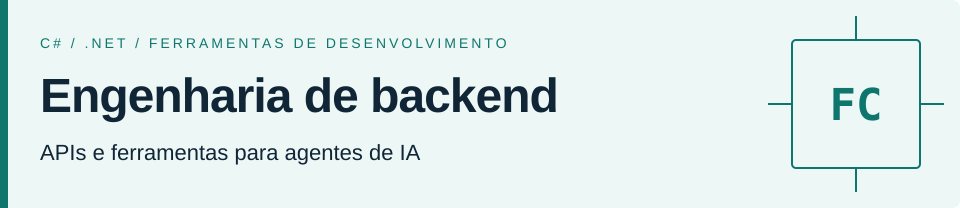

<picture>
  <source media="(max-width: 600px)" srcset="assets/header-mobile.svg">
  <source media="(prefers-color-scheme: dark)" srcset="assets/header-dark-pt-BR.svg">
  
</picture>

# Felipe Cabral

**Engenheiro de software · Backend .NET e ferramentas para agentes de IA**

Desenvolvo APIs em .NET e ferramentas para trabalhar com agentes de IA. Meus projetos públicos abordam arquitetura de aplicações, testes automatizados e revisão de interfaces de software. Moro em Brasília, DF.

[LinkedIn](https://www.linkedin.com/in/felipesbcabral/) · [E-mail](mailto:felipesbcabral@gmail.com) · [English](README.md)

## Projetos em destaque

### [agentic-os](https://github.com/felipesbcabral/agentic-os)

Toolkit em Markdown para agentes de IA, com etapas de revisão, ciclos de execução e verificação. Inclui adaptadores para Claude Code e Codex.

`Agentes de IA` `Ferramentas de desenvolvimento` `Markdown` `JavaScript`

### [software-ui-design](https://github.com/felipesbcabral/software-ui-design)

Skill para projetar e revisar interfaces de SaaS. Combina pesquisa de componentes com verificações automatizadas em tamanhos de desktop, tablet e celular.

`Engenharia de UI` `Node.js` `Playwright` `Claude Code / Codex`

### [codeflix-backend](https://github.com/felipesbcabral/codeflix-backend)

Projeto de estudo de uma API de catálogo de vídeos em C# e .NET. Explora Clean Architecture e DDD, com projetos de testes unitários, de integração e de ponta a ponta.

`C#` `.NET` `Entity Framework Core` `MySQL` `Testes`

### [parking-challenge](https://github.com/felipesbcabral/parking-challenge)

Desafio de uma API de gestão de estacionamento, com camada de domínio separada, validação de requisições e testes unitários.

`C#` `.NET` `MongoDB` `MediatR` `xUnit`

## Tecnologias

**Backend:** C#, .NET, Entity Framework Core, SQL / MySQL e MongoDB. 
**Ferramentas:** JavaScript, TypeScript, Node.js, Git, Docker e GitHub Actions.

Animação do gráfico de contribuições

 
<picture>
  <source media="(prefers-color-scheme: dark)" srcset="assets/contributions-dark.svg">
  
</picture>

Gerada semanalmente a partir do gráfico de contribuições do GitHub com [snk](https://github.com/Platane/snk). A animação é desativada quando a preferência por movimento reduzido está habilitada. [Workflow](https://github.com/felipesbcabral/Felipesbcabral/actions/workflows/profile.yml).

